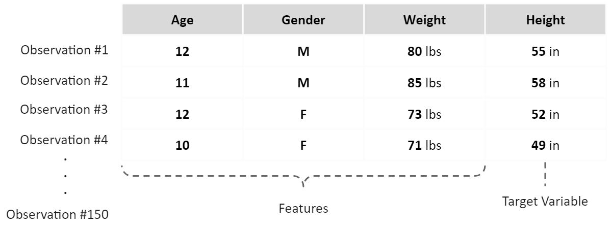

# Class 16 - Machine Learning Intro

## [Data Science Primer](https://elitedatascience.com/primer)

In the "80/20" of data science, the 80% of applied machine learning can be broken down into

* Exploratory analysis
* Data cleaning
* Feature engineering
* Algorithm selection
* Model training

The other 20% accounts for:

* Project scoping
* Data wrangling
* Preprocessing
* Ensembling

**Tips**:

1. Don't sweat the details (for now)
2. Don't worry about coding (yet).
3. Machine learning should not be haphazard and piecemeal. It should be systematic and organized.
4. Better data beats fancier algorithms
5. Understand how the moving pieces fit together first, then dive deeper

### **Birds Eye View**

* **Big misconception:** Machine learning is not about algorithms
* **Truth:** Machine learning is a comprehensive approach to solving problems
  * Individual algorithms are only one piece of the puzzle

Machine learning is learning from patterns, not explicit programming

**Terminology**:

|Term | Definition |
| --- | --- |
| Model | A set of patterns learned from data |
| Algorithm | A specific ML process used to train a model |
| Training data | The dataset from which the *algorithm* learns the *model* |
| Test data | A new dataset for reliably evaluating model performance |
| Features | Variables (columns) in the dataset used to train the model |
| Target variable | A specific variable you're trying to predict |
| Observations | Data points (rows) in the dataset |

**Example**:

You have a dataset of 150 primary school students, you wish to predict their Height based on their Age, Gender, and Weight

* You have 150 observations
* 1 target variable (height)
* 3 features (Age, Gender, Weight)
* You might then seperate your dataset into two subsets:
  * Set of 120 used to train several models (training set)
  * Set of 30 used to pick the best model (test set)

**The 3 Elements of Great Machine Learning** -

1. A skilled chef (human guidance)
2. Fresh ingredients (clean, relevant data)
3. Don't overcook it (avoid overfitting)

**The Blueprint** - 5 core steps:

1. Exploratory Analysis
2. Data Cleaning
3. Feature Engineering
4. Algorithm Selection
5. Model Training

---

## [Machine Learning - Apples and Oranges](https://www.youtube.com/watch?v=cKxRvEZd3Mw)

Machine learning can be described as a subfield of artificial intelligence

* It learns from examples and experience.

We need to create an algorithm that can figure out the rules for us, so we don't have to write them all every time

* To do this, **train a classifier**

* Classifier - think of it as a function
  * It takes some data as input, and assigns a label to it as output
  * Classifier --> Decision tree, think of it as a "Box of rules"
* Algorithm --> The procedure that creates rules in classifier

Supervised Learning: create a classifier by finding patterns in examples

* SUPERVISED LEARNING RECIPE
  * Collect training data
  * Train classifier
  * Make predictions

The more training data you have, the better a classifier you can create

* Features - first columns (inputs)
* Labels - last column (output)

Important Concepts:

* How does this work in the real world?
* How much training data do you need?
* How is the tree created?
* What makes a good feature?

---

## [Data Wrangling](https://elitedatascience.com/python-data-wrangling-tutorial)

Data wrangling is the process of reshaping, aggregating, separating, or otherwise transofming your data from one format to a more useful one.

**Steps for analysis**:

1. Set up your environment
2. Import libraries and dataset
3. Understand the data
4. **Filter** unwanted observations
5. **Pivot** the dataset
6. **Shift** the pivoted dataset
7. **Melt** the shifted dataset
8. **Reduce-merge** the melted data
9. **Aggregate** with group-by
